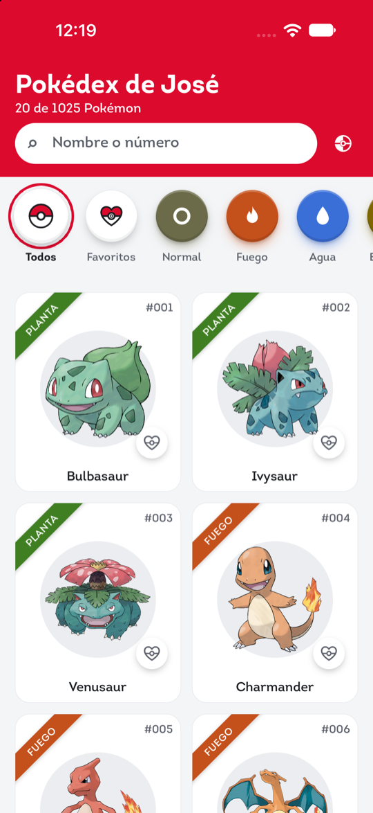
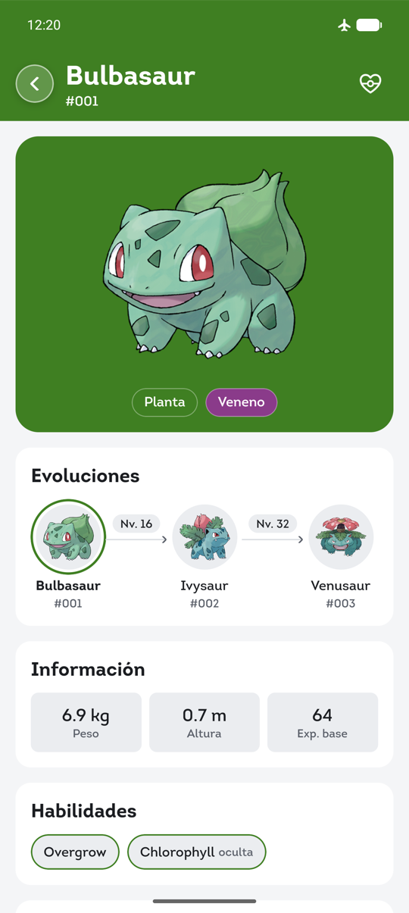
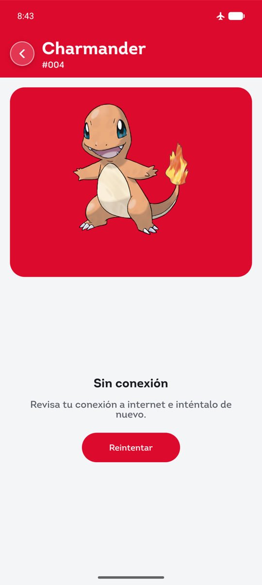
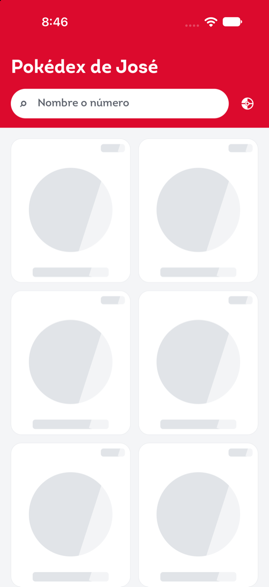
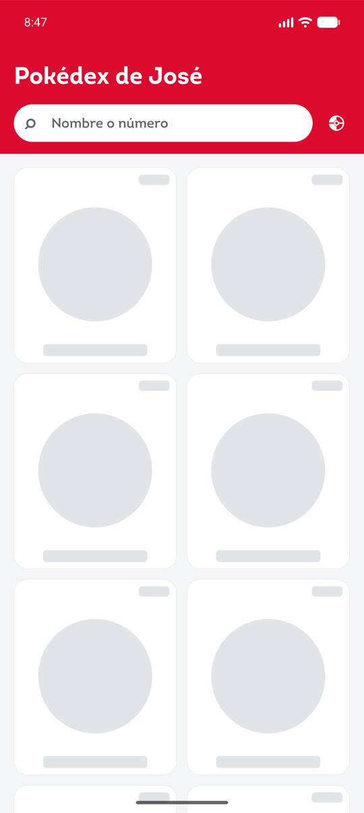
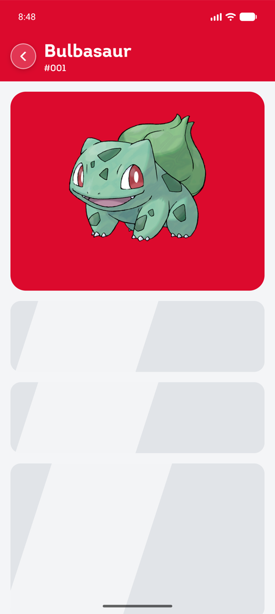
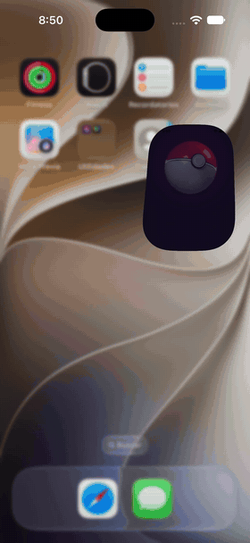
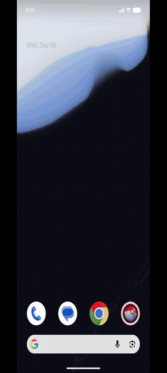
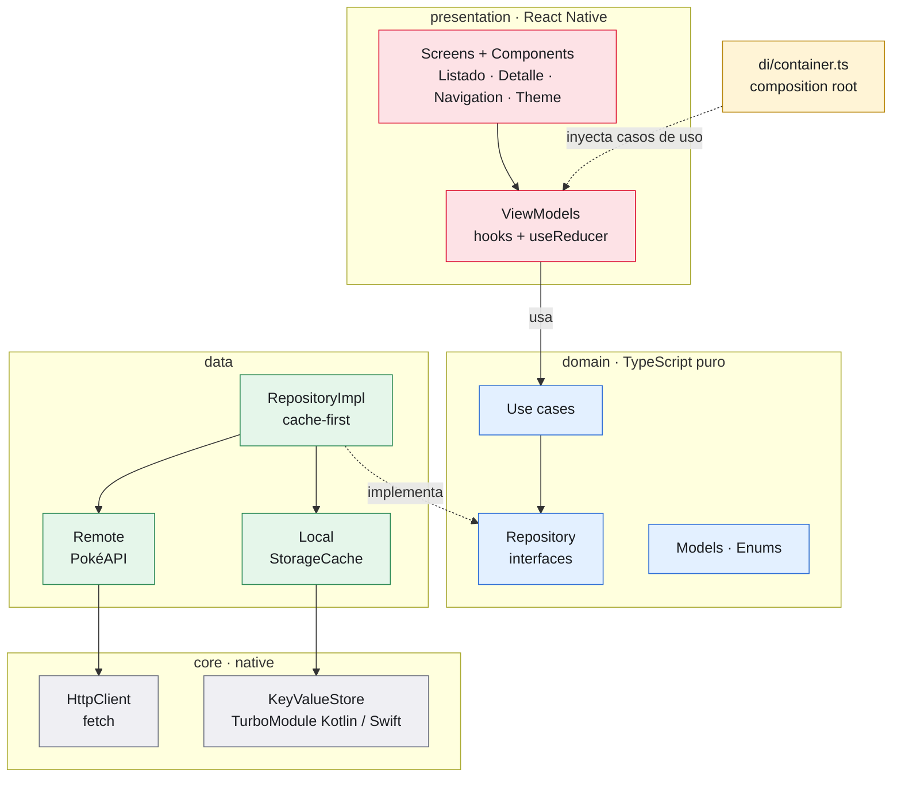

# Pokédex de José — React Native

Aplicación móvil (Android / iOS) que consume [PokéAPI](https://pokeapi.co/). Muestra los
primeros 20 Pokémon con paginación incremental, un detalle completo y persistencia local
con soporte offline parcial.

**Sin librerías externas:** `dependencies` contiene solo `react` y `react-native`. Lo que la
plataforma no trae (almacenamiento persistente, safe area y navegación) se construyó con la
infraestructura de React Native: TurboModules propios en **Kotlin** y **Swift**, y un stack
navigator propio en TypeScript.

| Listado (iOS) | Detalle (Android) | Offline: detalle cacheado | Offline: sin caché |
|---|---|---|---|
|  |  |  |  |

**Skeletons de carga.** Aparecen solo si la carga tarda más de 150 ms y, una vez visibles,
duran al menos 300 ms para que no parpadeen. Si los datos vienen del caché, no se muestran.
Para estas capturas se retrasó la respuesta a propósito; la interfaz es la real.

| Listado (iOS) | Listado (Android) | Detalle (Android) |
|---|---|---|
|  |  |  |

**Arranque de la app.** Splash animado, listado con su primera página y scroll.

| iOS | Android |
|---|---|
|  |  |

---

## 1. Requisitos

| Herramienta | Versión |
|---|---|
| Node.js | ≥ 22.11 |
| JDK | 17 |
| Android SDK | compileSdk 37 · minSdk 24 |
| Xcode | 27 (verificado) · deployment target iOS 15.1 · CocoaPods vía Bundler |

Guía oficial de entorno: https://reactnative.dev/docs/set-up-your-environment

## 2. Instalación y ejecución

Con un emulador Android abierto (o un dispositivo conectado) y/o Xcode instalado:

```sh
# 1. Clonar el repositorio
git clone https://github.com/featlast/pokejose.git
cd pokejose

# 2. Dependencias JS: el repo fija versiones con package-lock.json (npm)
npm ci                 # reproducible; equivalente con Yarn: yarn install

# 3. Solo iOS: la primera vez o si cambian dependencias nativas
bundle install
cd ios && bundle exec pod install && cd ..

# 4. Compilar, instalar y abrir. Metro se levanta solo si no está corriendo.
npm run android        # o: yarn android
npm run ios            # o: yarn ios
```

> - `yarn android` / `yarn ios` y `npm run android` / `npm run ios` ejecutan el mismo script
>   de `package.json`. Como el lockfile es de npm, usa `npm ci` para instalar en un clon nuevo:
>   `yarn install` no tiene `yarn.lock` y resolvería las versiones de cero.
> - Los TurboModules usan **codegen**: Gradle lo ejecuta automáticamente en Android y
>   `pod install` lo hace en iOS. No hay pasos manuales adicionales.
> - **Sin conexión:** el build de desarrollo depende de Metro, así que el modo avión lo
>   desconecta. Para probar offline, usa el build release, que incluye el JS:
>   `cd android && ./gradlew assembleRelease` e instala `app/build/outputs/apk/release/app-release.apk`.

## 3. Pruebas y calidad

```sh
npm test               # 177 pruebas: unitarias, de componentes e integración
npm run test:coverage  # cobertura (~92 % de líneas)
npm run typecheck      # tsc --noEmit (strict)
npm run lint           # ESLint (@react-native)
npm run format:check   # Prettier
npm run validate       # todo lo anterior
```

CI: `.github/workflows/ci.yml` ejecuta typecheck, lint, formato y pruebas, y compila Android e iOS.

## 4. Metodología: Spec-Driven Development + flujo agéntico

El proyecto se construyó con **SDD**. Los artefactos viven en el repositorio y son la fuente de verdad:

| Artefacto | Contenido |
|---|---|
| [`specs/constitution.md`](specs/constitution.md) | Principios no negociables (cero dependencias, Clean Architecture, tipado estricto…) |
| [`specs/001-pokedex/spec.md`](specs/001-pokedex/spec.md) | Requisitos del PDF con ID (`FR`, `BR`, `NFR`) y criterio de aceptación |
| [`specs/001-pokedex/plan.md`](specs/001-pokedex/plan.md) | Arquitectura y **decisiones técnicas (ADR-01…08)** |
| [`specs/001-pokedex/tasks.md`](specs/001-pokedex/tasks.md) | Tareas trazables a requisitos |
| [`specs/002-ux-enhancements/`](specs/002-ux-enhancements/spec.md) | Mejoras fuera del PDF (búsqueda, tema, cinta de tipo…) con su plan (ADR-10…15) y tareas |
| [`AGENTS.md`](AGENTS.md) | Patrón agéntico **Orchestrator–Workers + Evaluator–Optimizer** y compuertas de calidad |

## 5. Arquitectura

Clean Architecture con MVVM en la presentación. Las flechas sólidas son llamadas; las punteadas,
quién implementa o inyecta. Todas las dependencias apuntan al **dominio**, que no conoce React ni la red.



```
src/
├── core/          config · errors (AppError, ErrorCode.enum) · http · storage
├── domain/        enums · models · repositories (interfaces) · usecases
├── data/          datasources (local/remote) · dto · mappers · repositories
├── di/            container.ts (composition root) · DependenciesContext
├── native/specs/  specs de codegen de los TurboModules
└── presentation/  components · enums · hooks · navigation · screens · theme · utils
```

**Convención para identificar tipos:** `*.model.ts` (modelos de dominio),
`*.interface.ts` (contratos), `*.enum.ts`, `*.types.ts` (tipos de estado/props), `*.dto.ts`
(contratos de la API).

### Principios aplicados
- **SRP:** cada clase hace una cosa. `FetchHttpClient` solo transporta, el mapper solo traduce, el
  repositorio solo decide la política de caché y el view model solo orquesta el estado de la pantalla.
- **OCP / DIP:** repositorio, fuentes de datos, cliente HTTP y almacenamiento se consumen por interfaz.
  Cambiar el almacenamiento nativo por SQLite solo requiere un adaptador nuevo.
- **ISP:** la UI solo ve `AppDependencies` (casos de uso), no repositorios ni red.
- **DI:** `createAppDependencies()` construye el grafo una vez; los tests inyectan fakes.

### Decisiones técnicas principales (detalle en `plan.md`)
| Decisión | Justificación |
|---|---|
| **Persistencia:** TurboModule `NativeKeyValueStore` (Kotlin + Swift) basado en archivos | RN ya no trae almacenamiento multiplataforma y la restricción prohíbe AsyncStorage. Un archivo por clave, E/S en hilo de fondo serializado y escritura atómica |
| **Caché:** cache-first con TTL (lista 24 h, detalle 7 días) + versión de esquema + respaldo stale | Los datos de Pokémon casi no cambian. Sin red se muestran datos vencidos con aviso. Pull-to-refresh fuerza actualización |
| **Navegación:** stack navigator propio, tipado | Transiciones con driver nativo, botón atrás de Android, gesto de borde en iOS. El listado conserva el scroll |
| **Safe area:** TurboModule `NativeSafeArea` | `SafeAreaView` está deprecado en RN 0.87 y Android usa edge-to-edge |
| **Estado:** `useReducer` por pantalla | Reducers puros y testeables. No hace falta estado global |
| **Imagen del listado derivada del ID** | Evita 20 peticiones extra (N+1) |
| **iOS: `SceneDelegate`** | iOS 27 exige el ciclo de vida UIScene; el template original fallaba al iniciar |
| **Tipos en el listado vía índice de tipos** (spec 002) | `/type/{tipo}` una vez (~21 KB × 18, cacheado 7 días) en vez del detalle por tarjeta (~279 KB c/u) |
| **Búsqueda local** (spec 002) | PokéAPI no tiene búsqueda: se descarga y cachea el índice de nombres (~1350) y se filtra en memoria; funciona offline |
| **Tema: siempre arranca en Sistema** (spec 002, FR-210) | La elección Claro/Oscuro dura la sesión y no se guarda; `Appearance.setColorScheme` para lo nativo. Iconos propios derivados de la esfera Lumen (PNG monocromos + `tintColor`, sin SVG) |
| **Shared transition propia** (spec 002) | Registro de elementos + clon en overlay animado en el driver nativo; fundido cruzado sincronizado; respaldo si la tarjeta no es visible. Se evaluó hacerla nativa en Kotlin/Swift y se descartó (ADR-14) |
| **Header colapsable en el driver nativo** (spec 002) | Solo `transform`/`opacity`. El espacio del header se reserva con `paddingTop` en ambas plataformas: en iOS, `contentInset` se descartó porque `UIRefreshControl` lo reescribe al refrescar |
| **Tipografía Intro + `AppText`** | Intro Bold solo en títulos e Intro Regular en el resto, registradas como assets en Android (`assets/fonts`) e iOS (`UIAppFonts`). Todo texto pasa por `AppText` (variantes de tipografía, color del tema y tope de escalado por accesibilidad); ESLint prohíbe importar `Text` fuera de él. En iOS, `AppText` corrige las métricas verticales de Intro (altura de línea fija + leve desplazamiento), calibradas midiendo píxeles contra Android para que el texto quede centrado igual en ambas plataformas |
| **Splash animado sin librerías** | Escena animada en Blender y exportada como capas; `AnimatedSplash` las anima con `Animated` y un único reloj en el driver nativo. El splash nativo es solo el color de fondo, así no hay saltos |

## 6. Funcionalidades y bonus

- Listado de 20 Pokémon, **paginación infinita** de 20 en 20 y pull-to-refresh.
- Estados de **carga (skeletons)**, **error** con reintento, **vacío** y **aviso offline**.
- Detalle: tipos, habilidades (incluida la oculta), 6 estadísticas animadas + total, peso, altura
  y experiencia base. El color sigue el tipo principal.
- **Errores centralizados:** `AppError` + `ErrorCode` → mensajes amigables en un solo mapa.
- **Accesibilidad:** roles (`button`, `header`, `alert`, `progressbar` con `accessibilityValue`),
  labels, pantallas cubiertas ocultas al lector de pantalla, áreas táctiles ≥ 44/48, contraste AA y modo oscuro.
- **Rendimiento:** `FlatList` virtualizada, `React.memo` y callbacks estables, animaciones con
  driver nativo, caché en disco y caché nativo de imágenes.
- **Responsive:** de 2 a 5 columnas según el ancho (teléfono, horizontal, tablet).
- **Búsqueda** por nombre o número (`25`, `#025`), sin distinguir mayúsculas ni acentos, con
  *debounce* y funcionamiento offline.
- **Cinta diagonal de tipo** en cada tarjeta, con el color del tipo principal.
- **Header colapsable:** al hacer scroll, el título se achica y aparecen el ícono de la app, la barra
  de búsqueda fija y el selector de tema.
- **Modo oscuro** con selector **Sistema / Claro / Oscuro** e iconos propios. La app arranca siempre en **Sistema**.
- **Shared transition:** al abrir un Pokémon, su imagen vuela desde la tarjeta hasta el detalle
  (y vuelve al regresar), animada en el driver nativo y sin librerías.
- **Carga cuidada:** skeleton con *shimmer* que llena la pantalla, sin parpadeo en cargas rápidas;
  imágenes con *fade-in* y fallback; precarga de la página siguiente (datos e imágenes).
- **Identidad de arranque:** icono propio (adaptive icon en Android, AppIcon en iOS) y un splash
  animado de 3,6 s. La esfera cae, se tambalea, se abre y la luz se funde con el fondo de la app.
  La primera página se carga mientras corre la animación. Con "Reducir movimiento" solo hay un
  fundido. El arte es propio, modelado en Blender; sus archivos fuente no se versionan.

## 7. Librerías

| Paquete | Tipo | Motivo |
|---|---|---|
| `react`, `react-native` | runtime | Plataforma (única dependencia permitida) |
| TypeScript, ESLint, Prettier, Jest, `react-test-renderer` | dev | Tooling incluido en el template oficial de RN CLI |

Se **eliminaron** del template `react-native-safe-area-context` y `@react-native/new-app-screen`.

## 8. Pendientes, trade-offs y mejoras futuras

- Sin revalidación en segundo plano (stale-while-revalidate). Se eligió cache-first por simplicidad.
- Sin política de expulsión (LRU) del caché en disco: < 2 MB estimados.
- La conectividad se infiere del error de `fetch` (NetInfo es externo).
- El splash dura 3,6 s en cada arranque en frío y la apertura de la tapa es una aproximación 2D
  del giro 3D del render. Se podría añadir "tocar para saltar".
- Sin pruebas E2E (Detox/Maestro son dependencias externas). El flujo offline se verificó
  manualmente en Android (build release en modo avión); ver capturas.
- Nombres de habilidades en inglés (traducirlos requiere una llamada extra por habilidad).
- Filtros por tipo: pospuestos. El índice de tipos ya está listo para habilitarlos sin peticiones nuevas.
- Favoritos fuera de alcance.
